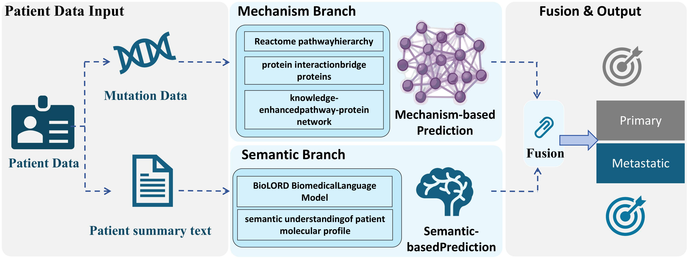

# KEPPNet

**A Knowledge-Enhanced Pathway--Protein Network with Biomedical Semantic
Augmentation for Genomics-Based Primary-versus-Metastatic Cancer
Classification**



KEPPNet is a dual-branch framework for classifying the status of an already
profiled tumor sample as primary or metastatic from somatic mutation and
copy-number alteration data. It is not a longitudinal model of future metastatic
risk. The repository accompanies the manuscript by Peng Peng, Wenjia Guo, Gang
Sun, and Liang He.

## Method summary

The structural branch propagates patient genomic alterations through a sparse,
biologically constrained network constructed from:

- the Reactome pathway hierarchy;
- STRING v12.0 protein association evidence;
- protein-mediated connections between related pathways;
- hierarchy-aware filtering and hub control; and
- optional two-hop knowledge-graph relation completion.

The semantic branch converts the same molecular alterations into deterministic,
label-free biomedical descriptions and encodes them with the frozen
`FremyCompany/BioLORD-2023` model. Only a lightweight classifier is trained on
top of the embeddings. The two branch probabilities are combined by decision-
level fusion:

```text
p_final = lambda * p_structured + (1 - lambda) * p_semantic
```

`lambda` is selected from `{0.0, 0.1, ..., 1.0}` by validation AUC and is fixed
before test-set evaluation. A fixed probability threshold of `0.5` converts
probabilities to class predictions.

## Leakage safeguards

The text passed to BioLORD contains molecular information only: mutation genes,
copy-number amplification/deletion genes, alteration counts, and pathway
involvement computed from those alterations. The summary generator does not
insert labels, sample status, anatomical site, study/source identifiers, or
train/validation/test membership. Labels and split names are stored separately
and joined only after the text has been generated.

## Repository structure

```text
KEPPNet-code/
|-- configs/
|   |-- model/                 # Main and ablation configurations
|   `-- dataset/               # PRAD and BRCA dataset configurations
|-- docs/
|   |-- data_preparation.md
|   |-- model_architecture.md
|   `-- reproducibility.md
|-- example_data/              # Synthetic format examples only
|-- scripts/
|   |-- prepare_data/
|   |-- train/
|   |-- evaluate/
|   `-- analyze/
|-- src/
|   |-- data/
|   |-- models/
|   |-- training/
|   |-- evaluation/
|   `-- interpretability/
|-- requirements.txt
`-- LICENSE
```

## Installation

Python 3.10 is recommended.

```bash
git clone https://github.com/qaz5435/KEPPNet-code.git
cd KEPPNet-code
python -m venv .venv
source .venv/bin/activate
python -m pip install --upgrade pip
python -m pip install -r requirements.txt
```

Run the synthetic smoke test:

```bash
python scripts/run_demo.py
python -m unittest discover -s tests -v
```

The demo verifies data loading and model execution but does not reproduce paper
performance.

## Data sources

The manuscript uses the following public cBioPortal studies:

| Cohort | cBioPortal study identifiers |
|---|---|
| PRAD | `prad_p1000` |
| BRCA | `brca_igr_2015`, `brca_mbcproject_wagle_2017`, `brca_mbcproject_2022`, `brca_tcga_pan_can_atlas_2018` |

Patient-level files are not redistributed in this repository. Download them
from cBioPortal and use them according to the source study terms. Reactome,
STRING, and BioLORD resources must likewise be downloaded from their official
repositories. Exact filenames and directory layouts are documented in
[`docs/data_preparation.md`](docs/data_preparation.md).

## Reproduction workflow

After downloading the public cohort and knowledge files, prepare each cohort in
its own directory (the commands below never overwrite another cohort):

```bash
# 1. Convert cBioPortal raw files to aligned mutation/CNA/label matrices
python -m src.data.processor.medical_data.prepare_data \
  --cancer_type prostate --study_names prad_p1000
python -m src.data.processor.medical_data.prepare_data \
  --cancer_type breast --study_names brca_igr_2015 \
  brca_mbcproject_wagle_2017 brca_mbcproject_2022 \
  brca_tcga_pan_can_atlas_2018

# 2. Create fixed 8:1:1 split files
python -m src.data.processor.medical_data.split_data \
  --processed_dir data/structured/prad/processed \
  --output_dir data/structured/prad/splits \
  --seed 422342
python -m src.data.processor.medical_data.split_data \
  --processed_dir data/structured/brca/processed \
  --output_dir data/structured/brca/splits \
  --seed 422342

# 3. Build label-free summaries
python scripts/prepare_data/build_patient_summaries.py --cancer_type prostate
python scripts/prepare_data/build_patient_summaries.py --cancer_type breast

# 4. Define aligned sample sets
python scripts/prepare_data/define_experiment_sets.py

# 5. Encode the dual-branch sample set with frozen BioLORD
python scripts/prepare_data/build_biolord_embeddings.py \
  --cancer_type prostate --set_name dual_strict_set
python scripts/prepare_data/build_biolord_embeddings.py \
  --cancer_type breast --set_name dual_strict_set

# 6. Train both branches and evaluate the canonical decision-level fusion
python scripts/train.py --mode dual_branch
```

The scripts under `scripts/evaluate/` provide branch-only comparisons, saved
probability exports, and feature-level-fusion ablations. They are analysis
utilities rather than a replacement for the canonical dual-branch runner.

The main model configurations are `configs/model/prad-main.json` and
`configs/model/brca-main.json`. Both use 300 epochs, batch size 50, Adam with an
initial learning rate of `1e-3`, L2 coefficient `1e-3`, and a learning-rate
multiplier of `0.25` every 50 epochs, consistent with the manuscript.

## Interpretability

```bash
python src/interpretability/run_attribution.py \
  --method deeplift --cancer_type prostate

python src/interpretability/run_attribution.py \
  --method integratedgradients --cancer_type prostate

python src/interpretability/run_attribution.py \
  --method gradientshap --cancer_type prostate

python src/interpretability/summarize_multi_attribution.py \
  --model prad-main --dataset prostate_kg --n-runs 10

python src/interpretability/attribution_perturbation.py \
  --cancer_type prostate --method deeplift --layer h2
```

Attribution analyses operate on the structured branch and report gene-,
pathway-, and bridge-protein-level signals. Perturbation analysis should be
interpreted as evidence of model reliance, not biological causality.

## Code--paper correspondence

| Manuscript component | Implementation |
|---|---|
| Structured pathway--protein branch | `src/models/pathpronet.py` |
| KG-enhanced network construction | `src/data/processor/pathway_protein/pathway_protein_kg_enhanced.py` |
| Label-free text construction | `scripts/prepare_data/build_patient_summaries.py` |
| Frozen BioLORD encoding | `scripts/prepare_data/build_biolord_embeddings.py` |
| Canonical semantic branch and decision-level fusion | `scripts/train/train_dual_branch.py` |
| Fusion from previously exported probabilities | `scripts/evaluate/eval_late_fusion.py` |
| Feature-level fusion ablation | `scripts/evaluate/eval_feature_fusion.py` |
| Multi-method attribution | `src/interpretability/attribution_methods.py` |
| Repeated-seed attribution summary | `src/interpretability/summarize_multi_attribution.py` |
| Attribution-guided perturbation | `src/interpretability/attribution_perturbation.py` |

## Availability notes

- cBioPortal cohort data are public but are not duplicated here.
- BioLORD weights are available from
  [FremyCompany/BioLORD-2023](https://huggingface.co/FremyCompany/BioLORD-2023).
- Reactome files are available from
  [Reactome Downloads](https://reactome.org/download-data).
- STRING v12.0 files are available from
  [STRING Downloads](https://string-db.org/cgi/download).
- The two cohort-specific selected-gene lists and four KG-derived relation
  tables listed in `docs/data_preparation.md` are required for an exact run of
  the reported main configuration. Archive them with a versioned release or
  supply them with the review package; running without them is not an exact
  reproduction of the reported model.

## Citation

Until a journal citation is available, cite the accompanying manuscript as:

```bibtex
@unpublished{peng2026keppnet,
  author = {Peng, Peng and Guo, Wenjia and Sun, Gang and He, Liang},
  title  = {{KEPPNet}: A Knowledge-Enhanced Pathway--Protein Network with
            Biomedical Semantic Augmentation for Genomics-Based
            Primary-versus-Metastatic Cancer Classification},
  note   = {Manuscript submitted for publication},
  year   = {2026}
}
```

## License

Released under the MIT License. See [`LICENSE`](LICENSE).
